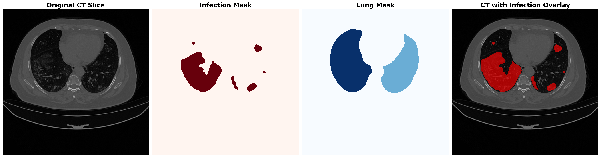
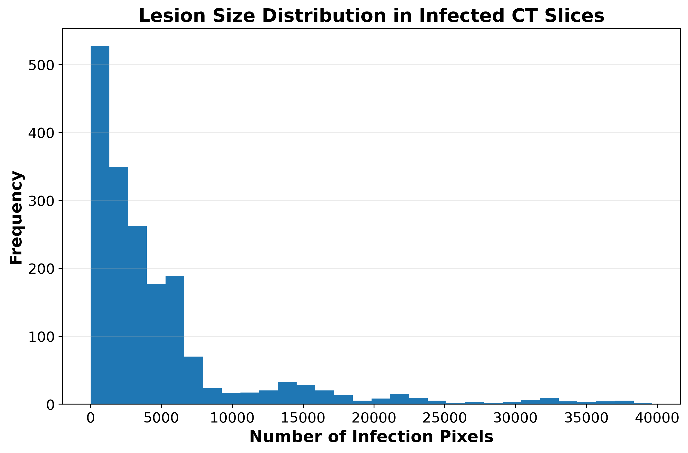
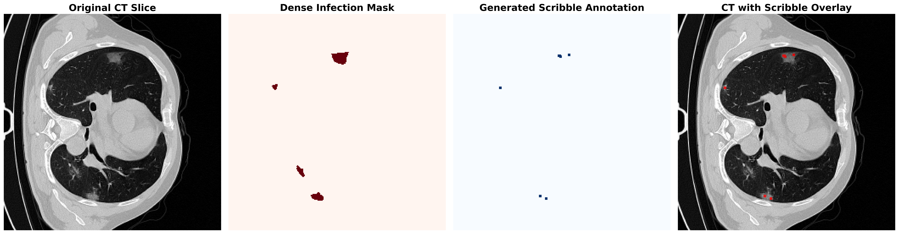
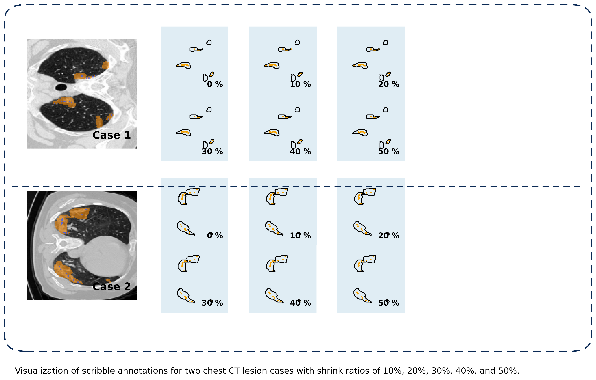
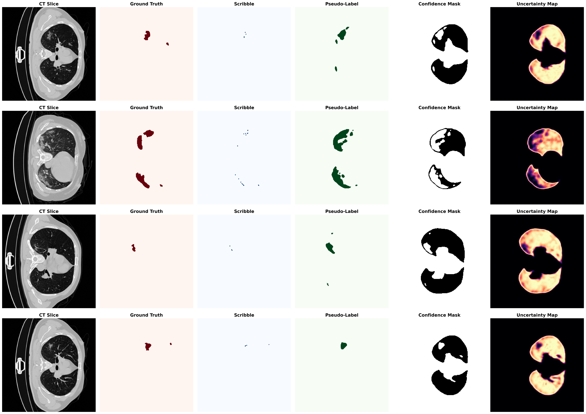
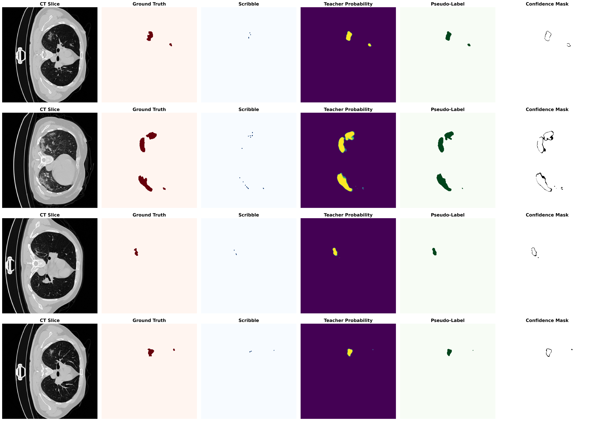
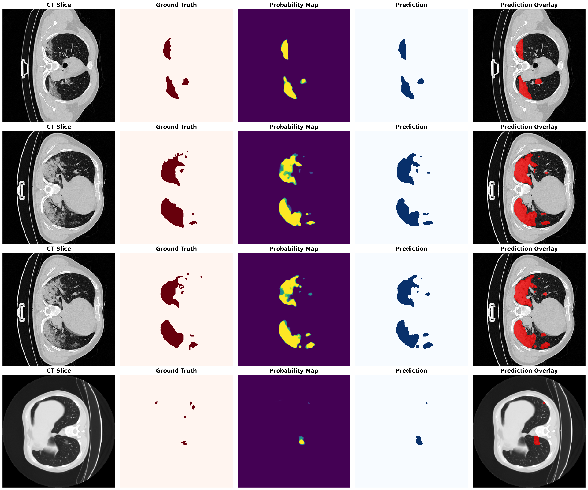
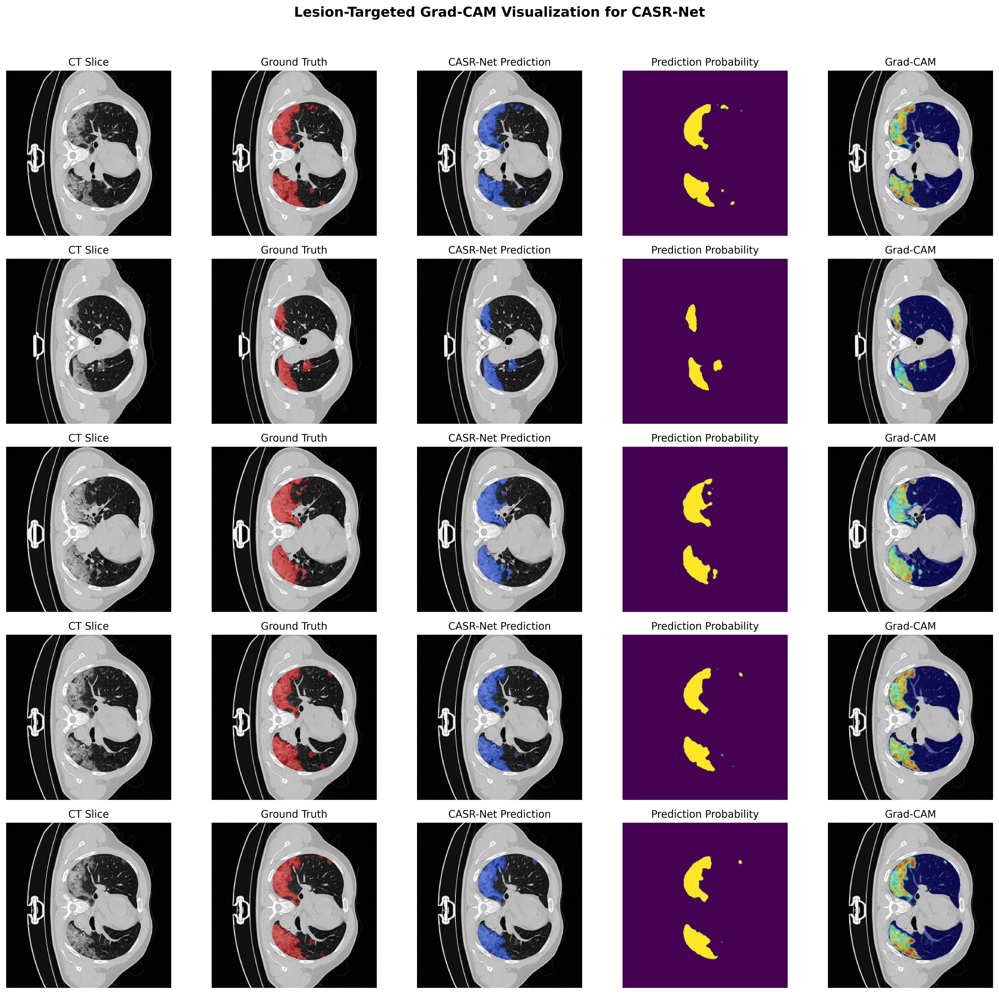

# CASR-Net: Confidence-Aware Scribble Refinement for Weakly Supervised Lung Lesion Segmentation in Chest CT

This repository contains the implementation and experimental outputs for **CASR-Net**, a confidence-aware weakly supervised framework for lung lesion segmentation in chest computed tomography (CT). CASR-Net learns dense lesion masks from sparse scribble annotations by combining foreground/background scribble anchors, teacher-guided pseudo-label generation, confidence-aware pseudo-label selection, and confidence-weighted student refinement.

The goal of this work is to reduce the dependence on costly dense pixel-level annotations while preserving reliable lesion localization under weak supervision.

---

## Overview

Fully supervised lung lesion segmentation requires dense expert annotations, which are expensive and time-consuming to obtain. Scribble annotations provide a practical alternative because they require only sparse lesion and background markings. However, directly expanding scribbles into dense pseudo labels can introduce noisy supervision, especially around uncertain lesion boundaries and low-contrast regions.

CASR-Net addresses this problem by selecting reliable foreground and background regions from teacher probability maps while suppressing uncertain pseudo-labeled pixels during student training.

<p align="center">
  
</p>

**Figure:** Overview of the CASR-Net pipeline. Sparse foreground and background scribbles are used as anchor supervision. A teacher model generates lesion probability maps, from which reliable foreground and background pseudo labels are selected. The student model is optimized using scribble supervision, confidence-selected pseudo labels, and soft teacher consistency.

---

## Main Contributions

- We propose **CASR-Net**, a confidence-aware weakly supervised framework for lung lesion segmentation from sparse scribble annotations.

- We use foreground and background scribbles as reliable supervision anchors to preserve lesion localization and reduce false-positive expansion.

- We introduce teacher-guided pseudo-label refinement to expand sparse scribble supervision into denser lesion guidance.

- We design a confidence-aware foreground and background selection strategy that emphasizes reliable pseudo-labeled pixels and suppresses uncertain regions.

- We formulate a confidence-weighted student refinement objective combining scribble supervision, confidence-selected pseudo labels, and soft teacher consistency.

- We validate CASR-Net on two chest CT lesion segmentation datasets using quantitative comparisons, ablation studies, qualitative predictions, and Grad-CAM visualizations.

---

## Dataset Visualization

The following examples illustrate the difference between dense lesion annotations and sparse scribble annotations used for weak supervision.

<p align="center">
  
</p>

**Figure:** Representative CT slice, dense lesion annotation, and sparse scribble annotation.

The lesion size distribution highlights the variability of lesion regions across CT slices.

<p align="center">
  
</p>

**Figure:** Lesion size distribution across the dataset.

Sparse scribble annotations are generated from dense masks to simulate annotation-efficient weak supervision.

<p align="center">
  
</p>

**Figure:** Example of scribble annotation generation from lesion masks.

---

## Scribble Annotation Analysis

CASR-Net is designed for weak supervision, where scribbles provide sparse but informative lesion cues. The following visualization shows how different shrink ratios affect scribble annotations.

<p align="center">
  
</p>

**Figure:** Visualization of scribble annotations under different shrink ratios.

---

## Confidence-Aware Pseudo-Label Refinement

A central component of CASR-Net is confidence-aware pseudo-label refinement. Instead of using all teacher predictions as hard labels, CASR-Net selects reliable pseudo-labeled foreground and background regions and suppresses uncertain pixels.

<p align="center">
  
</p>

**Figure:** Confidence-aware pseudo-label refinement examples showing CT slice, ground truth, scribble annotation, pseudo-label, confidence mask, and uncertainty map.

The teacher-assisted pseudo-label examples further illustrate how teacher probability maps guide the refinement process.

<p align="center">
  
</p>

**Figure:** Teacher-assisted pseudo-label refinement examples used for weakly supervised student training.

---

## Qualitative Segmentation Results

The qualitative predictions show that CASR-Net can localize irregular lesion regions while reducing excessive false-positive expansion.

<p align="center">
  
</p>

**Figure:** Qualitative segmentation predictions using test-time augmentation.

---

## Grad-CAM Visualization

Grad-CAM visualization is used to examine whether the trained model focuses on lesion-relevant regions.

<p align="center">
  
</p>

**Figure:** Lesion-targeted Grad-CAM visualization of CASR-Net.

---

## Quantitative Results

### CASR-Net Performance on Two Datasets

| Dataset | Dice | IoU | Sensitivity | Specificity | Precision | Accuracy | MAE |
|---|---:|---:|---:|---:|---:|---:|---:|
| Dataset-1 | **0.8046** | **0.7165** | **0.8351** | 0.9969 | **0.8355** | 0.9941 | 0.0059 |
| Dataset-2 | 0.7879 | 0.6501 | 0.7744 | **0.9986** | 0.8019 | **0.9969** | **0.0031** |

---

### Dataset-2 Validation Comparison

| Method | Dice | IoU | Sensitivity | Specificity | Precision | Accuracy | MAE |
|---|---:|---:|---:|---:|---:|---:|---:|
| Scribble-only | 0.1387 | 0.0745 | **0.9952** | 0.9076 | 0.0745 | 0.9082 | 0.0918 |
| Scribble + background | 0.5769 | 0.4054 | 0.4850 | 0.9985 | 0.7118 | 0.9947 | 0.0053 |
| Fully supervised teacher | 0.7801 | 0.6395 | 0.7940 | 0.9982 | 0.7667 | 0.9967 | 0.0033 |
| **CASR-Net** | **0.7879** | **0.6501** | 0.7744 | **0.9986** | **0.8019** | **0.9969** | **0.0031** |

---

### Dataset-1 Ablation Study

| Method | Dice | IoU | MAE |
|---|---:|---:|---:|
| Scribble-only | 0.059 | 0.031 | 0.7810 |
| Scribble + background | 0.338 | 0.240 | 0.0596 |
| Weak uncertainty refinement | 0.346 | 0.248 | 0.0527 |
| **CASR-Net** | **0.805** | **0.716** | **0.0059** |

---

### Dataset-2 Ablation Study

| Method | Dice | IoU | MAE |
|---|---:|---:|---:|
| Scribble-only | 0.1387 | 0.0745 | 0.0918 |
| Scribble + background | 0.5769 | 0.4054 | 0.0053 |
| Fully supervised teacher | 0.7801 | 0.6395 | 0.0033 |
| **CASR-Net** | **0.7879** | **0.6501** | **0.0031** |

---

## Model Complexity

| Model | Parameters | GMACs | GFLOPs |
|---|---:|---:|---:|
| CASR-Net | 2.672 M | 5.134 | 10.268 |

---

## Method Summary

CASR-Net consists of the following stages:

1. **Scribble-based weak supervision**  
   Sparse foreground and background scribbles are used as reliable anchor labels.

2. **Teacher-guided pseudo-label generation**  
   A teacher model generates lesion probability maps from CT images.

3. **Confidence-aware foreground/background selection**  
   High-confidence lesion and background regions are selected from teacher predictions.

4. **Student model refinement**  
   The student model is optimized using scribble supervision, confidence-selected pseudo labels, and soft teacher consistency.

5. **Inference**  
   During inference, only the trained student model is used. Scribbles and teacher guidance are not required.

---

## Repository Structure

```text
scribble-uncertainty-lung-segmentation/
│
├── data/
│   └── dataset2_covid_lesion/
│
├── outputs/
│   ├── figures/
│   │   ├── dataset/
│   │   ├── paper/
│   │   └── results/
│   └── tables/
│
├── scripts/
├── notebooks/
├── requirements.txt
└── README.md
```

---

## Installation

Clone the repository:

```bash
git clone https://github.com/itsCodeBakery/scribble-uncertainty-lung-segmentation.git
cd scribble-uncertainty-lung-segmentation
```

Create and activate a Python environment:

```bash
python -m venv casrnet_env
source casrnet_env/bin/activate
```

Install dependencies:

```bash
pip install -r requirements.txt
```

---

## Usage

The repository contains scripts and outputs for preprocessing, scribble generation, teacher training, student refinement, evaluation, and figure generation.

A typical workflow is:

```text
1. Prepare CT images and dense lesion masks.
2. Generate sparse foreground/background scribble annotations.
3. Train the fully supervised teacher model.
4. Generate teacher probability maps.
5. Train CASR-Net using scribbles, confidence-selected pseudo labels, and teacher consistency.
6. Evaluate the trained student model.
7. Generate qualitative figures and tables.
```

---

## Evaluation Metrics

The following metrics are used for segmentation evaluation:

- Dice Index
- Intersection over Union
- Sensitivity
- Specificity
- Precision
- Accuracy
- Mean Absolute Error
- Boundary Dice
- HD95
- ASSD

---

## Paper Title

**CASR-Net: Confidence-Aware Scribble Refinement for Weakly Supervised Lung Lesion Segmentation in Chest CT**

---

## Code Availability

The source code is available at:

```text
https://github.com/itsCodeBakery/scribble-uncertainty-lung-segmentation
```

---

## Citation

If you use this repository or find the work helpful, please cite:

```bibtex
@misc{casrnet2026,
  title  = {CASR-Net: Confidence-Aware Scribble Refinement for Weakly Supervised Lung Lesion Segmentation in Chest CT},
  author = {Syed Shayan Ali Shah},
  year   = {2026},
  note   = {GitHub repository},
  url    = {https://github.com/itsCodeBakery/scribble-uncertainty-lung-segmentation}
}
```

---

## Acknowledgment

This repository was developed for research on annotation-efficient lung lesion segmentation using weak scribble supervision and confidence-aware pseudo-label refinement.

---


Then update the image path in this README accordingly.
